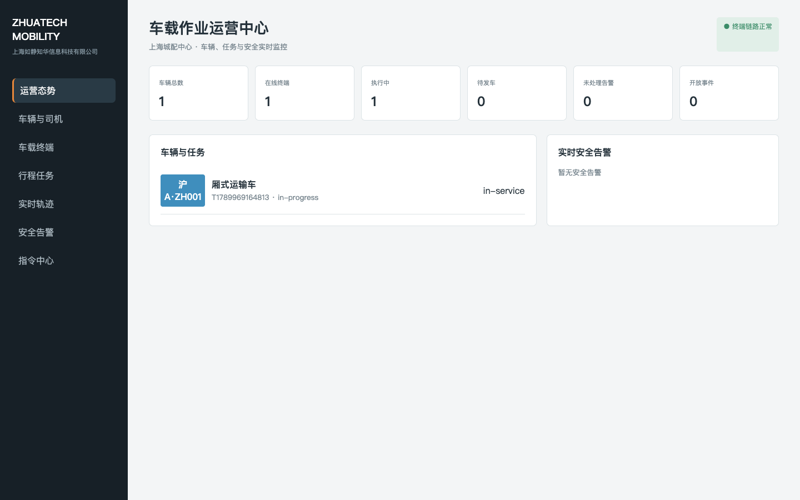
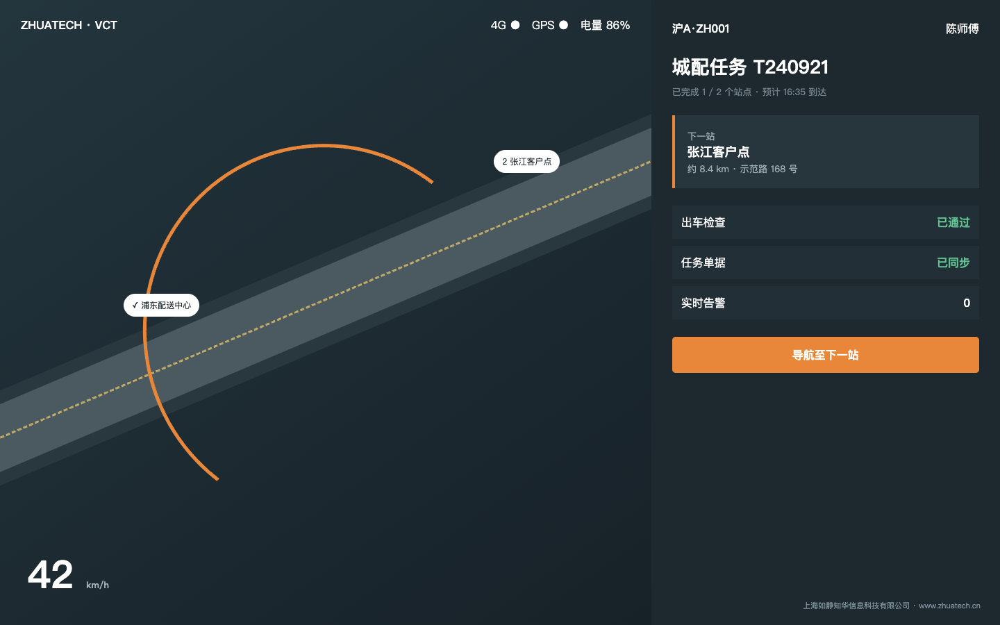

# 知华车载作业终端与行程安全平台

`zhuatech-vehicle-terminal` 面向城配物流、环卫、工程车辆、园区接驳和企业班车，聚焦“驾驶员车机”这一端：任务接收、出车检查、顺序站点、围栏到站、离线序列、行车遥测、安全告警、事件上报和调度指令回执均已实现。它可与现有 TMS/车队系统协同，并不等同于普通车辆台账。

由[知华科技（上海如静知华信息科技有限公司）](https://www.zhuatech.cn/)维护。车机国产化、CAN/北斗/OBD 接入、车队数字化、商业授权或深度定制，请微信添加 `zhuatech` 或 `zhuatech2`。

| 调度运营中心 | 驾驶员车载终端 |
| --- | --- |
|  |  |

## 作业闭环

```text
车辆/司机/车机绑定 → 行程派单 → 出车检查 → 终端接单
→ 实时遥测与安全告警 → 围栏到站 → 事件上报 → 全站点完成
```

## 企业级核心功能

- 场站、车辆、司机证照与车机安全绑定；
- 带坐标和围栏的顺序站点任务；
- 制动、轮胎、灯光、证件车检，关键缺陷阻断发车；
- 单调递增遥测序列，超速、急刹和路线偏离告警；
- 围栏到站、站点顺序约束与全部到站后释放车辆；
- 司机事件上报、调度消息/限速/返场指令和回执；
- API Key、设备令牌入口、审计、JSON 快照、MySQL 与 Docker。

## 启动

```bash
cp .env.example .env
npm test
VEHICLE_API_KEY=zhuatech-demo-key npm start
```

运营端 `http://127.0.0.1:18204/`，车载端 `http://127.0.0.1:18204/vehicle`，健康检查 `/health`。生产环境应对接真实地图、北斗/GPS、CAN/OBD、消息队列和 TMS，并使用设备证书、TLS 与离线补传签名。

## 许可说明

项目仅允许个人非商业学习、研究和交流，**不得商用**。企业内部使用、车队上线、SaaS、实施、交付、投标或收费服务必须获得上海如静知华信息科技有限公司书面授权。本项目不是 OSI 定义的开源许可证项目。

| 微信号 `zhuatech` | 微信号 `zhuatech2` |
| --- | --- |
|  |  |

Copyright © 上海如静知华信息科技有限公司。
